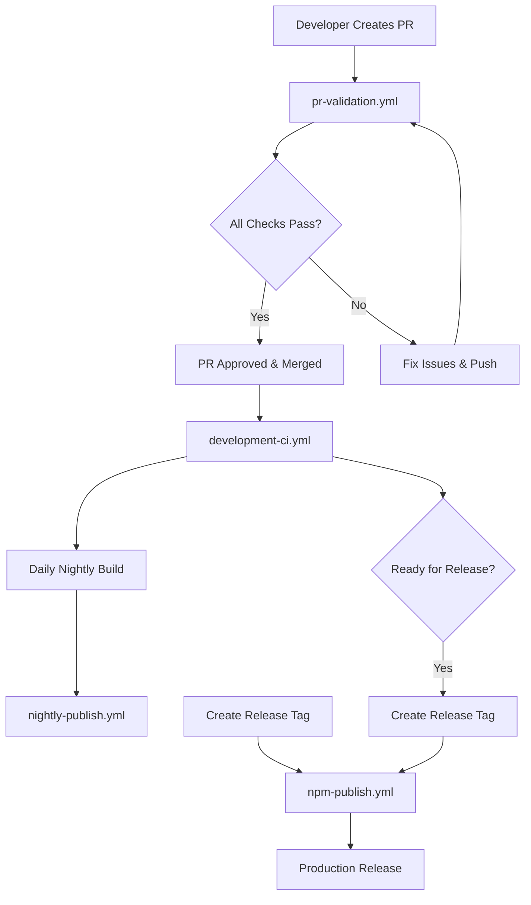

# Permaweb MCP CI/CD Pipeline Documentation

## Overview

This repository uses a comprehensive multi-stage CI/CD pipeline to ensure code quality, security, and reliable releases. The pipeline consists of four main workflow files that handle different aspects of development and deployment.

## Workflow Files

### 1. **pr-validation.yml** - Pull Request Validation
**Triggers:** Pull requests to `development` and `main` branches
**Purpose:** Comprehensive validation of pull requests before merge

**Jobs:**
- **check-skip**: Skips CI for draft PRs (unless `[ci]` in title)
- **quality-checks**: Code quality, linting, type checking, security audit
- **test-suite**: Unit and integration tests with coverage reporting
- **cross-platform-build**: Build validation across Ubuntu, Windows, macOS
- **performance-check**: Bundle size analysis and startup time testing
- **integration-tests**: Full integration testing and package validation
- **pr-validation-status**: Final status reporting and comments

**Key Features:**
- ✅ Multi-node version testing (Node 20, 22)
- ✅ Cross-platform validation
- ✅ Coverage threshold enforcement (85% lines, 90% functions)
- ✅ Security scanning and vulnerability checks
- ✅ Automated PR status comments
- ✅ Debug log detection and prevention

### 2. **development-ci.yml** - Development Branch Continuous Integration
**Triggers:** Pushes to `development` branch, daily scheduled runs
**Purpose:** Monitor development branch health and readiness

**Jobs:**
- **quick-validation**: Fast quality checks for immediate feedback
- **comprehensive-qa**: Full QA pipeline with multi-node testing
- **security-analysis**: Security auditing and vulnerability scanning
- **development-status**: Overall branch health reporting
- **release-readiness**: Pre-release validation and checks

**Key Features:**
- ⚡ Fast feedback loop for development pushes
- 🔒 Comprehensive security analysis
- 📊 Release readiness assessment
- 🚀 Integration smoke testing

### 3. **nightly-publish.yml** - Nightly Development Builds
**Triggers:** Daily at 5:00 AM UTC, manual workflow dispatch
**Purpose:** Automated nightly builds from development branch

**Jobs:**
- **nightly-publish**: Build, test, and publish nightly versions

**Key Features:**
- 🌙 Automated nightly builds with timestamp versioning
- 📦 NPM publishing with `nightly` tag
- 🏷️ GitHub pre-releases for testing
- 🔄 Rollback mechanisms for failed builds

**Version Format:** `{current-version}-nightly.{timestamp}`
**Installation:** `npm install permamind@nightly`

### 4. **npm-publish.yml** - Production Release Pipeline
**Triggers:** Git tags (v*), manual workflow dispatch
**Purpose:** Production releases to NPM with comprehensive validation

**Jobs:**
- **validate-package**: Multi-node package structure validation
- **cross-platform-test**: Cross-platform CLI testing
- **npm-publish**: NPM publication with release creation

**Key Features:**
- 🏗️ Comprehensive package validation
- 🌍 Cross-platform testing (Ubuntu, Windows, macOS)
- 📦 NPM publishing with proper tagging
- 🏷️ GitHub release creation with changelogs
- ✅ Post-publish verification

## Workflow Integration



## Quality Gates

### PR Validation Requirements
- ✅ Code linting (Prettier + ESLint)
- ✅ TypeScript type checking
- ✅ Security audit (npm audit)
- ✅ Test coverage > 85% lines, 90% functions
- ✅ Cross-platform build success
- ✅ Integration tests pass
- ✅ No debug logs in source code
- ✅ Bundle size analysis

### Development Branch Health
- ✅ All PR validation requirements
- ✅ Security vulnerability scanning
- ✅ Package installation testing
- ✅ MCP server initialization
- ✅ CLI functionality verification

### Release Requirements
- ✅ All development health checks
- ✅ Multi-platform compatibility
- ✅ Package structure validation
- ✅ Binary execution testing
- ✅ Post-publish verification

## Branch Strategy

```
main (production)
├── v1.0.0 (latest stable)
├── v1.1.0 (next stable)
└── development (active development)
    ├── feature/new-feature
    ├── fix/bug-fix
    └── PR merges
```

## Usage Examples

### Force CI on Draft PR
Add `[ci]` to your PR title to trigger full validation:
```
[ci] WIP: Add new memory features
```

### Manual Nightly Build
Trigger via GitHub Actions UI or:
```bash
gh workflow run nightly-publish.yml --ref development
```

### Create Production Release
```bash
# Create and push a new tag
git tag v1.0.1
git push --tags

# Or use NPM version commands
npm run version:patch  # Creates tag and pushes
```

### Monitor Workflow Status
```bash
# Check latest workflow runs
gh run list

# Watch specific workflow
gh run watch

# View workflow logs
gh run view [run-id] --log
```

## Environment Variables

### Required Secrets
- `NPM_TOKEN`: NPM authentication token for publishing
- `GITHUB_TOKEN`: GitHub token for releases (automatically provided)

### Optional Configuration
- `CODECOV_TOKEN`: Codecov integration token for coverage reporting

## Troubleshooting

### Common Issues

**1. PR Validation Fails on Coverage**
- Ensure test coverage meets thresholds (85% lines, 90% functions)
- Add tests for new code or mark as excluded if appropriate

**2. Cross-platform Build Failures**
- Check for OS-specific path issues
- Verify Node.js compatibility across versions

**3. Security Audit Failures**
- Update vulnerable dependencies
- Use `npm audit fix` for automatic fixes
- Document any unavoidable vulnerabilities

**4. Nightly Build Failures**
- Check development branch health
- Verify NPM token validity
- Review dependency compatibility

### Debug Commands
```bash
# Test workflows locally with act
act pull_request

# Run quality checks locally
npm run ci:quality

# Test package installation
npm pack --dry-run
```

## Pipeline Metrics

### Performance Targets
- **PR Validation**: < 15 minutes total runtime
- **Development CI**: < 10 minutes for quick validation
- **Nightly Build**: < 8 minutes end-to-end
- **Production Release**: < 20 minutes with full validation

### Success Rates (Target)
- **PR Validation**: > 95% first-pass success rate
- **Development CI**: > 98% success rate
- **Nightly Builds**: > 90% success rate
- **Production Releases**: > 99% success rate

---

## Maintenance

This pipeline is designed to be self-maintaining with the following automated features:
- Dependency vulnerability scanning
- Cross-platform compatibility testing
- Performance regression detection
- Automated rollback mechanisms
- Comprehensive error reporting

For pipeline modifications, please ensure all changes are tested in a feature branch with the `[ci]` flag before merging to development.