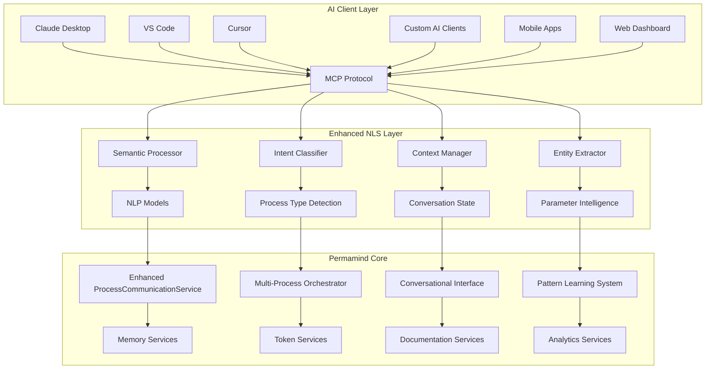
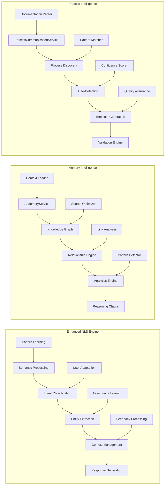
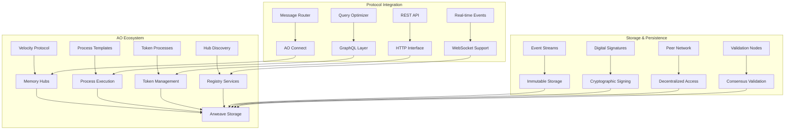

# 🏗 Permamind Architecture - Enhanced Edition

## Executive Summary

**Permamind** is a next-generation AI memory and interaction platform that combines immortal storage on Arweave with intelligent natural language processing to create a universal interface for AI agents in the decentralized web.

### Core Innovation

- **Immortal AI Memory**: Permanent, searchable memory storage on Arweave blockchain
- **Enhanced Natural Language Service (NLS)**: Semantic understanding and contextual AI interaction
- **Universal Protocol Interface**: Standardized interaction layer for any blockchain process
- **Intelligent Process Discovery**: Automatic detection and adaptation to new process types
- **Community-Driven Evolution**: Collaborative development of AI-blockchain integrations

## System Architecture Overview

### Layer 1: AI Interface Layer



### Layer 2: Intelligence & Processing Layer



### Layer 3: Decentralized Infrastructure Layer



## Core Components Deep Dive

### 1. Enhanced Natural Language Service (NLS)

#### Semantic Processing Engine

```typescript
interface SemanticProcessor {
  // Core semantic understanding
  parseSemanticIntent(input: string): Promise<SemanticIntent>;
  extractEntities(input: string): Promise<EntitySet>;
  analyzeContext(input: string, history: ConversationHistory): Promise<ContextAnalysis>;
  
  // Advanced language processing
  fuzzyMatch(input: string, patterns: Pattern[]): Promise<FuzzyMatchResult[]>;
  semanticSimilarity(input: string, reference: string): Promise<number>;
  languageNormalization(input: string): Promise<NormalizedInput>;
  
  // Multi-language support
  detectLanguage(input: string): Promise<LanguageDetection>;
  translateIntent(intent: SemanticIntent, targetLanguage: string): Promise<SemanticIntent>;
}

interface SemanticIntent {
  primaryAction: string;
  secondaryActions: string[];
  confidence: number;
  parameters: ParameterMap;
  ambiguities: AmbiguitySet;
  context: IntentContext;
  reasoning: IntentReasoning;
}
```

#### Intent Classification System

```typescript
interface IntentClassifier {
  // Process type identification
  classifyProcessType(input: string): Promise<ProcessTypeClassification>;
  determineOperationType(input: string): Promise<OperationTypeClassification>;
  
  // Multi-step operation support
  identifyOperationSequence(input: string): Promise<OperationSequence>;
  validateOperationChain(sequence: OperationSequence): Promise<ValidationResult>;
  
  // Confidence and disambiguation
  calculateConfidence(classification: Classification): Promise<number>;
  resolveAmbiguity(ambiguity: Ambiguity, context: ClassificationContext): Promise<Resolution>;
}

interface ProcessTypeClassification {
  processType: ProcessType;
  confidence: number;
  alternativeTypes: ProcessType[];
  requiredCapabilities: Capability[];
  suggestedHandlers: string[];
  reasoning: ClassificationReasoning;
}
```

#### Context Management System

```typescript
interface ContextManager {
  // Conversation state management
  maintainConversationContext(userId: string): Promise<ConversationContext>;
  updateContext(context: ConversationContext, interaction: Interaction): Promise<ConversationContext>;
  
  // Multi-turn operation support
  handleFollowUpQuestions(input: string, context: ConversationContext): Promise<FollowUpResponse>;
  maintainOperationState(operation: Operation, context: ConversationContext): Promise<OperationState>;
  
  // Cross-session learning
  persistUserPreferences(userId: string, preferences: UserPreferences): Promise<void>;
  loadUserContext(userId: string): Promise<UserContext>;
  
  // Context optimization
  optimizeContextWindow(context: ConversationContext): Promise<OptimizedContext>;
  detectContextShift(oldContext: ConversationContext, newContext: ConversationContext): Promise<ContextShift>;
}

interface ConversationContext {
  conversationId: string;
  userId: string;
  sessionId: string;
  
  // State tracking
  currentOperation?: Operation;
  operationHistory: Operation[];
  userPreferences: UserPreferences;
  
  // Context intelligence
  topics: Topic[];
  entities: Entity[];
  sentiment: SentimentAnalysis;
  complexity: ComplexityMetrics;
  
  // Temporal context
  startTime: Date;
  lastActivity: Date;
  duration: number;
  turnCount: number;
}
```

### 2. Enhanced Memory System

#### AI Memory Service Evolution

```typescript
interface EnhancedAIMemoryService extends AIMemoryService {
  // Advanced memory operations
  addMemoryWithContext(memory: AIMemory, context: MemoryContext): Promise<string>;
  searchMemoriesWithEmbedding(query: string, embedding: number[]): Promise<AIMemory[]>;
  
  // Intelligent clustering
  clusterMemories(memories: AIMemory[], algorithm: ClusteringAlgorithm): Promise<MemoryCluster[]>;
  detectMemoryPatterns(memories: AIMemory[]): Promise<MemoryPattern[]>;
  
  // Contextual retrieval
  retrieveContextualMemories(query: string, context: RetrievalContext): Promise<AIMemory[]>;
  rankMemoriesByRelevance(memories: AIMemory[], context: RankingContext): Promise<AIMemory[]>;
  
  // Memory optimization
  optimizeMemoryStorage(hubId: string): Promise<OptimizationResult>;
  detectDuplicateMemories(hubId: string): Promise<DuplicateDetectionResult>;
  
  // Learning and adaptation
  learnFromMemoryAccess(memory: AIMemory, accessContext: AccessContext): Promise<void>;
  adaptMemoryImportance(memory: AIMemory, feedback: UserFeedback): Promise<void>;
}
```

#### Knowledge Graph Engine

```typescript
interface KnowledgeGraphEngine {
  // Graph construction
  buildKnowledgeGraph(memories: AIMemory[]): Promise<KnowledgeGraph>;
  updateGraph(graph: KnowledgeGraph, newMemories: AIMemory[]): Promise<KnowledgeGraph>;
  
  // Relationship discovery
  discoverRelationships(memories: AIMemory[]): Promise<DiscoveredRelationship[]>;
  validateRelationships(relationships: MemoryLink[]): Promise<ValidationResult>;
  
  // Graph querying
  queryGraph(graph: KnowledgeGraph, query: GraphQuery): Promise<GraphResult>;
  findConnectedConcepts(graph: KnowledgeGraph, concept: string): Promise<ConceptConnection[]>;
  
  // Graph analytics
  analyzeGraphStructure(graph: KnowledgeGraph): Promise<GraphAnalytics>;
  detectGraphCommunities(graph: KnowledgeGraph): Promise<GraphCommunity[]>;
  
  // Graph optimization
  optimizeGraphStructure(graph: KnowledgeGraph): Promise<OptimizedGraph>;
  pruneWeakConnections(graph: KnowledgeGraph, threshold: number): Promise<PrunedGraph>;
}
```

### 3. Multi-Process Orchestration

#### Process Orchestrator

```typescript
interface MultiProcessOrchestrator {
  // Complex operation planning
  planMultiProcessOperation(input: string): Promise<OperationPlan>;
  optimizeOperationPlan(plan: OperationPlan): Promise<OptimizedPlan>;
  
  // Execution management
  executeOperationPlan(plan: OperationPlan): Promise<ExecutionResult>;
  monitorExecution(executionId: string): Promise<ExecutionStatus>;
  
  // Dependency management
  resolveDependencies(operations: Operation[]): Promise<DependencyGraph>;
  validateDependencies(graph: DependencyGraph): Promise<ValidationResult>;
  
  // Transaction coordination
  coordinateAtomicOperations(operations: Operation[]): Promise<CoordinationResult>;
  handleOperationFailures(failures: OperationFailure[]): Promise<RecoveryPlan>;
  
  // Rollback and recovery
  createCheckpoint(operationId: string): Promise<Checkpoint>;
  rollbackToCheckpoint(checkpoint: Checkpoint): Promise<RollbackResult>;
}

interface OperationPlan {
  planId: string;
  operations: PlannedOperation[];
  dependencies: DependencyGraph;
  estimatedDuration: number;
  riskAssessment: RiskAssessment;
  rollbackStrategy: RollbackStrategy;
}
```

### 4. Conversational AI Interface

#### Conversational NLS Interface

```typescript
interface ConversationalNLSInterface {
  // Natural conversation handling
  handleConversationalInput(input: string, context: ConversationContext): Promise<ConversationalResponse>;
  maintainConversationFlow(conversationId: string): Promise<ConversationFlow>;
  
  // Proactive assistance
  generateProactiveSuggestions(context: ConversationContext): Promise<ProactiveSuggestion[]>;
  predictUserIntent(context: ConversationContext): Promise<IntentPrediction>;
  
  // Error handling and recovery
  handleMisunderstanding(input: string, context: ConversationContext): Promise<ClarificationResponse>;
  recoverFromError(error: ConversationError, context: ConversationContext): Promise<RecoveryResponse>;
  
  // Personalization
  adaptToUserStyle(userId: string, interactions: Interaction[]): Promise<PersonalizationProfile>;
  generatePersonalizedResponse(response: Response, profile: PersonalizationProfile): Promise<PersonalizedResponse>;
}

interface ConversationalResponse {
  response: string;
  suggestions: ActionSuggestion[];
  context: ConversationContext;
  followUpQuestions: string[];
  confidence: number;
  reasoning: ResponseReasoning;
}
```

### 5. Pattern Learning System

#### Adaptive Pattern Learning

```typescript
interface PatternLearningSystem {
  // Pattern discovery
  discoverPatterns(interactions: Interaction[]): Promise<DiscoveredPattern[]>;
  validatePatterns(patterns: Pattern[]): Promise<ValidationResult>;
  
  // Pattern adaptation
  adaptPatterns(patterns: Pattern[], feedback: Feedback[]): Promise<AdaptedPattern[]>;
  optimizePatterns(patterns: Pattern[], performance: PerformanceMetrics): Promise<OptimizedPattern[]>;
  
  // Community learning
  sharePatterns(patterns: Pattern[], community: Community): Promise<SharingResult>;
  receivePatterns(community: Community): Promise<ReceivedPattern[]>;
  
  // Pattern application
  applyPatterns(input: string, patterns: Pattern[]): Promise<PatternApplication>;
  evaluatePatternEffectiveness(pattern: Pattern, applications: PatternApplication[]): Promise<EffectivenessMetrics>;
}

interface DiscoveredPattern {
  patternId: string;
  type: PatternType;
  confidence: number;
  frequency: number;
  effectiveness: number;
  applicability: string[];
  examples: PatternExample[];
}
```

## Advanced Features

### 1. Intelligent Process Discovery

#### Auto-Detection Engine

```typescript
interface ProcessDiscoveryEngine {
  // Process type detection
  detectProcessType(processId: string, sampleInteractions?: Interaction[]): Promise<ProcessDetection>;
  validateProcessType(processId: string, detectedType: ProcessType): Promise<ValidationResult>;
  
  // Capability analysis
  analyzeProcessCapabilities(processId: string): Promise<ProcessCapabilities>;
  inferProcessSchema(processId: string): Promise<ProcessSchema>;
  
  // Template generation
  generateProcessTemplate(processId: string, detection: ProcessDetection): Promise<ProcessTemplate>;
  optimizeTemplate(template: ProcessTemplate): Promise<OptimizedTemplate>;
  
  // Documentation generation
  generateDocumentation(processId: string, template: ProcessTemplate): Promise<GeneratedDocumentation>;
  validateDocumentation(documentation: Documentation): Promise<ValidationResult>;
}

interface ProcessDetection {
  processType: ProcessType;
  confidence: number;
  capabilities: ProcessCapability[];
  handlers: HandlerInfo[];
  schema: ProcessSchema;
  documentation: GeneratedDocumentation;
}
```

### 2. Community Pattern Platform

#### Pattern Marketplace

```typescript
interface PatternMarketplace {
  // Pattern publishing
  publishPattern(pattern: Pattern, author: Author): Promise<PublicationResult>;
  validatePattern(pattern: Pattern): Promise<ValidationResult>;
  
  // Pattern discovery
  discoverPatterns(criteria: DiscoveryCriteria): Promise<PatternDiscovery[]>;
  searchPatterns(query: string): Promise<PatternSearchResult[]>;
  
  // Quality assurance
  reviewPattern(pattern: Pattern, reviewer: Reviewer): Promise<ReviewResult>;
  ratePattern(pattern: Pattern, rating: Rating): Promise<RatingResult>;
  
  // Usage analytics
  trackPatternUsage(pattern: Pattern, usage: UsageMetrics): Promise<void>;
  generateUsageReport(pattern: Pattern): Promise<UsageReport>;
}

interface PatternDiscovery {
  pattern: Pattern;
  metadata: PatternMetadata;
  quality: QualityMetrics;
  usage: UsageMetrics;
  community: CommunityMetrics;
}
```

### 3. Enterprise Features

#### Security & Compliance

```typescript
interface SecurityManager {
  // Access control
  validateAccess(user: User, resource: Resource, operation: Operation): Promise<AccessResult>;
  auditAccess(accessAttempt: AccessAttempt): Promise<AuditResult>;
  
  // Data protection
  encryptSensitiveData(data: SensitiveData): Promise<EncryptedData>;
  decryptSensitiveData(encryptedData: EncryptedData): Promise<SensitiveData>;
  
  // Compliance monitoring
  checkCompliance(operation: Operation, regulations: Regulation[]): Promise<ComplianceResult>;
  generateComplianceReport(timeRange: TimeRange): Promise<ComplianceReport>;
  
  // Threat detection
  detectAnomalies(activities: Activity[]): Promise<AnomalyDetection>;
  assessThreatLevel(activity: Activity): Promise<ThreatAssessment>;
}

interface ComplianceManager {
  // Regulatory compliance
  validateRegulatory(operation: Operation, jurisdiction: Jurisdiction): Promise<RegulatoryResult>;
  trackDataLineage(data: Data): Promise<DataLineage>;
  
  // Audit trails
  createAuditTrail(operation: Operation): Promise<AuditTrail>;
  retrieveAuditTrail(criteria: AuditCriteria): Promise<AuditTrail[]>;
  
  // Data governance
  enforceDataPolicies(data: Data, policies: DataPolicy[]): Promise<EnforcementResult>;
  validateDataRetention(data: Data, retentionPolicy: RetentionPolicy): Promise<ValidationResult>;
}
```

## Performance & Scalability

### 1. Intelligent Caching

```typescript
interface IntelligentCachingSystem {
  // Multi-layer caching
  cachePattern(pattern: Pattern, priority: CachePriority): Promise<void>;
  cacheMemory(memory: AIMemory, accessPattern: AccessPattern): Promise<void>;
  cacheProcessDefinition(definition: ProcessDefinition, usage: UsageMetrics): Promise<void>;
  
  // Cache optimization
  optimizeCacheStrategy(metrics: CacheMetrics): Promise<OptimizedCacheStrategy>;
  evictStaleEntries(cache: Cache): Promise<EvictionResult>;
  
  // Predictive caching
  predictCacheNeeds(usage: UsagePattern): Promise<CachePrediction>;
  preloadCache(prediction: CachePrediction): Promise<PreloadResult>;
  
  // Distributed caching
  syncCacheAcrossNodes(nodes: CacheNode[]): Promise<SyncResult>;
  balanceCacheLoad(nodes: CacheNode[]): Promise<BalanceResult>;
}
```

### 2. Query Optimization

```typescript
interface QueryOptimizer {
  // Query analysis
  analyzeQuery(query: Query): Promise<QueryAnalysis>;
  optimizeQueryPlan(plan: QueryPlan): Promise<OptimizedQueryPlan>;
  
  // Index management
  createOptimalIndexes(queries: Query[]): Promise<IndexCreationResult>;
  maintainIndexes(indexes: Index[]): Promise<MaintenanceResult>;
  
  // Performance monitoring
  monitorQueryPerformance(query: Query): Promise<PerformanceMetrics>;
  identifySlowQueries(threshold: number): Promise<SlowQuery[]>;
  
  // Optimization recommendations
  generateOptimizationRecommendations(metrics: PerformanceMetrics): Promise<Recommendation[]>;
  implementOptimizations(recommendations: Recommendation[]): Promise<ImplementationResult>;
}
```

### 3. Load Balancing & Distribution

```typescript
interface LoadBalancer {
  // Request distribution
  distributeRequests(requests: Request[]): Promise<DistributionResult>;
  balanceLoad(nodes: Node[]): Promise<BalanceResult>;
  
  // Health monitoring
  monitorNodeHealth(nodes: Node[]): Promise<HealthStatus[]>;
  handleNodeFailure(failedNode: Node, activeNodes: Node[]): Promise<FailoverResult>;
  
  // Auto-scaling
  determineScalingNeed(metrics: LoadMetrics): Promise<ScalingDecision>;
  scaleResources(decision: ScalingDecision): Promise<ScalingResult>;
  
  // Geographic distribution
  optimizeGeographicDistribution(users: User[]): Promise<GeographicOptimization>;
  routeToNearestNode(user: User, nodes: Node[]): Promise<RoutingResult>;
}
```

## Security Architecture

### 1. Advanced Security Measures

```typescript
interface SecuritySystem {
  // Identity verification
  verifyIdentity(credentials: Credentials): Promise<IdentityVerification>;
  authenticateUser(user: User, challenge: Challenge): Promise<AuthenticationResult>;
  
  // Authorization
  authorizeOperation(user: User, operation: Operation): Promise<AuthorizationResult>;
  enforcePermissions(user: User, resource: Resource): Promise<PermissionResult>;
  
  // Threat detection
  detectThreats(activities: Activity[]): Promise<ThreatDetection>;
  respondToThreat(threat: Threat): Promise<ThreatResponse>;
  
  // Security analytics
  analyzeSecurityMetrics(metrics: SecurityMetrics): Promise<SecurityAnalysis>;
  generateSecurityReport(timeRange: TimeRange): Promise<SecurityReport>;
}
```

### 2. Data Protection & Privacy

```typescript
interface DataProtectionSystem {
  // Encryption
  encryptData(data: Data, encryptionKey: EncryptionKey): Promise<EncryptedData>;
  decryptData(encryptedData: EncryptedData, decryptionKey: DecryptionKey): Promise<Data>;
  
  // Privacy preservation
  anonymizeData(data: Data): Promise<AnonymizedData>;
  pseudonymizeData(data: Data): Promise<PseudonymizedData>;
  
  // Data minimization
  minimizeDataCollection(data: Data, purpose: Purpose): Promise<MinimizedData>;
  validateDataNecessity(data: Data, purpose: Purpose): Promise<ValidationResult>;
  
  // Privacy compliance
  checkPrivacyCompliance(data: Data, regulations: PrivacyRegulation[]): Promise<ComplianceResult>;
  handlePrivacyRequests(request: PrivacyRequest): Promise<PrivacyResponse>;
}
```

## Deployment & Operations

### 1. Cloud-Native Architecture

```typescript
interface CloudNativeDeployment {
  // Container orchestration
  deployContainers(containers: Container[]): Promise<DeploymentResult>;
  scaleContainers(containers: Container[], scalingPolicy: ScalingPolicy): Promise<ScalingResult>;
  
  // Service mesh
  configureServiceMesh(services: Service[]): Promise<ServiceMeshConfig>;
  monitorServiceMesh(mesh: ServiceMesh): Promise<MeshMetrics>;
  
  // Infrastructure as code
  provisionInfrastructure(infrastructure: Infrastructure): Promise<ProvisioningResult>;
  manageInfrastructure(infrastructure: Infrastructure): Promise<ManagementResult>;
  
  // CI/CD pipeline
  deployPipeline(pipeline: Pipeline): Promise<PipelineResult>;
  monitorPipeline(pipeline: Pipeline): Promise<PipelineMetrics>;
}
```

### 2. Monitoring & Observability

```typescript
interface ObservabilitySystem {
  // Metrics collection
  collectMetrics(components: Component[]): Promise<MetricsCollection>;
  aggregateMetrics(metrics: Metrics[]): Promise<AggregatedMetrics>;
  
  // Logging
  collectLogs(services: Service[]): Promise<LogCollection>;
  analyzeLogs(logs: Log[]): Promise<LogAnalysis>;
  
  // Tracing
  traceRequests(requests: Request[]): Promise<TraceCollection>;
  analyzeTraces(traces: Trace[]): Promise<TraceAnalysis>;
  
  // Alerting
  configureAlerts(alertRules: AlertRule[]): Promise<AlertConfiguration>;
  handleAlerts(alerts: Alert[]): Promise<AlertResponse>;
  
  // Dashboard
  generateDashboard(metrics: Metrics[]): Promise<Dashboard>;
  updateDashboard(dashboard: Dashboard, newMetrics: Metrics[]): Promise<UpdatedDashboard>;
}
```

## Integration Ecosystem

### 1. Protocol Integrations

```typescript
interface ProtocolIntegration {
  // Protocol adapters
  createProtocolAdapter(protocol: Protocol): Promise<ProtocolAdapter>;
  configureAdapter(adapter: ProtocolAdapter, config: AdapterConfig): Promise<ConfiguredAdapter>;
  
  // Message translation
  translateMessage(message: Message, fromProtocol: Protocol, toProtocol: Protocol): Promise<TranslatedMessage>;
  validateTranslation(original: Message, translated: TranslatedMessage): Promise<ValidationResult>;
  
  // Protocol discovery
  discoverProtocols(criteria: DiscoveryCriteria): Promise<ProtocolDiscovery[]>;
  analyzeProtocol(protocol: Protocol): Promise<ProtocolAnalysis>;
  
  // Integration management
  manageIntegrations(integrations: Integration[]): Promise<IntegrationResult>;
  monitorIntegrations(integrations: Integration[]): Promise<IntegrationMetrics>;
}
```

### 2. API Gateway

```typescript
interface APIGateway {
  // Request routing
  routeRequest(request: Request): Promise<RoutingResult>;
  loadBalanceRequests(requests: Request[]): Promise<LoadBalanceResult>;
  
  // Rate limiting
  applyRateLimit(request: Request, policy: RateLimitPolicy): Promise<RateLimitResult>;
  monitorRateLimit(endpoint: Endpoint): Promise<RateLimitMetrics>;
  
  // Authentication & authorization
  authenticateRequest(request: Request): Promise<AuthenticationResult>;
  authorizeRequest(request: Request, user: User): Promise<AuthorizationResult>;
  
  // API versioning
  manageAPIVersions(versions: APIVersion[]): Promise<VersioningResult>;
  migrateAPIVersion(fromVersion: APIVersion, toVersion: APIVersion): Promise<MigrationResult>;
}
```

## Future Roadmap

### Phase 1: Enhanced Foundation (Q1 2025)
- **Advanced NLS Engine**: Semantic processing and contextual understanding
- **Intelligent Caching**: Multi-layer caching with predictive algorithms
- **Enhanced Security**: Advanced threat detection and data protection
- **Performance Optimization**: Query optimization and load balancing

### Phase 2: AI Intelligence (Q2 2025)
- **Machine Learning Integration**: Advanced pattern recognition and learning
- **Predictive Analytics**: Proactive suggestions and trend analysis
- **Automated Optimization**: Self-tuning performance and resource allocation
- **Conversational AI**: Natural dialogue and multi-turn conversations

### Phase 3: Enterprise Platform (Q3 2025)
- **Enterprise Features**: Advanced security, compliance, and governance
- **Cloud-Native Deployment**: Kubernetes, service mesh, and auto-scaling
- **Integration Ecosystem**: Protocol adapters and API gateway
- **Community Platform**: Pattern marketplace and collaborative development

### Phase 4: Global Scale (Q4 2025)
- **Global Distribution**: Multi-region deployment and edge computing
- **Advanced Analytics**: Real-time insights and business intelligence
- **Ecosystem Integration**: Deep integration with major platforms
- **Research Platform**: Academic and research collaborations

## Conclusion

The enhanced Permamind architecture represents a paradigm shift in AI-blockchain interaction, combining the permanence of decentralized storage with the intelligence of advanced natural language processing. This comprehensive system provides the foundation for truly autonomous AI agents that can seamlessly interact with any decentralized process while maintaining perfect memory of all interactions.

Through careful implementation of this architecture, Permamind will establish itself as the essential infrastructure for the next generation of AI systems in the decentralized web, providing the memory, intelligence, and interface capabilities needed to build truly autonomous and intelligent applications.

The modular, extensible design ensures that as the ecosystem evolves, Permamind can adapt and grow, maintaining its position as the definitive platform for AI-blockchain integration while continuously pushing the boundaries of what's possible in decentralized AI systems.