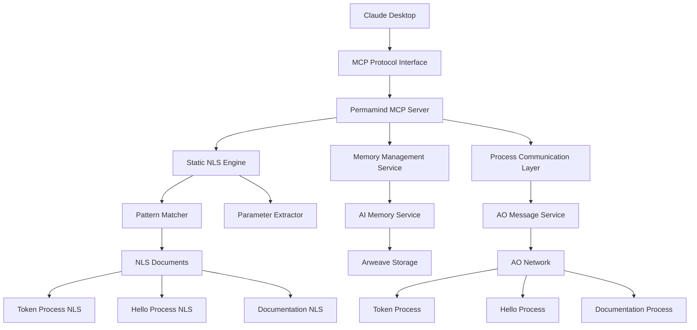
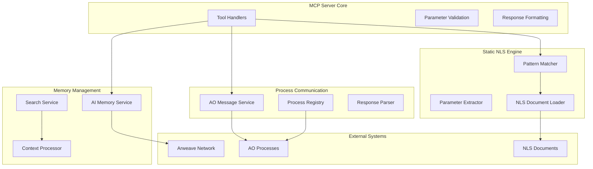
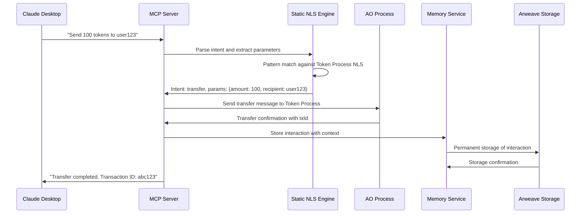
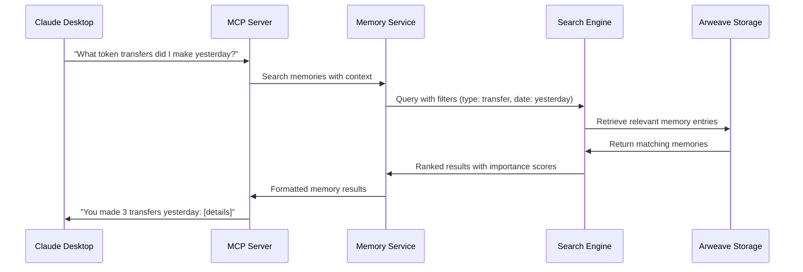

# Permamind Architecture Document

## Introduction

This document outlines the overall project architecture for Permamind, including backend systems, shared services, and non-UI specific concerns. Its primary goal is to serve as the guiding architectural blueprint for AI-driven development, ensuring consistency and adherence to chosen patterns and technologies.

**Relationship to Frontend Architecture:**
This project is primarily a backend MCP (Model Context Protocol) server with CLI interfaces. No separate frontend architecture is required as the primary user interface is through Claude Desktop's MCP integration.

### Starter Template or Existing Project

**Foundation:** This project builds upon the existing Permamind codebase, which is already a functional MCP server with AO/Arweave integration. The current architecture serves as the foundation for the enhanced MVP implementation described in the PRD.

**Existing Architecture Components:**
- FastMCP TypeScript framework for MCP server implementation
- AO Connect integration for decentralized process communication
- Arweave integration for permanent memory storage
- Comprehensive test suite with Vitest
- Node.js 20+ runtime with TypeScript 5.0+ compilation

### Change Log

| Date | Version | Description | Author |
|------|---------|-------------|---------|
| 2025-01-16 | 1.0 | Initial architecture document creation | Winston (Architect) |

## High Level Architecture

### Technical Summary

Permamind implements a layered MCP server architecture that bridges natural language AI interactions with decentralized blockchain processes. The system uses a static NLS (Natural Language Service) engine for MVP implementation, providing pattern-based intent recognition and parameter extraction. Core components include memory management services, process communication layers, and permanent storage integration with Arweave, all orchestrated through a FastMCP server framework that integrates seamlessly with Claude Desktop.

### High Level Overview

**Architectural Style:** Modular Monolith with Service-Oriented Components
**Repository Structure:** Monorepo with clear service boundaries
**Service Architecture:** Single deployable unit with distinct service layers
**Primary Flow:** AI Client → MCP Protocol → Permamind Core → Static NLS → AO Process → Arweave Storage

**Key Architectural Decisions:**
1. **Static NLS for MVP:** Simple pattern matching over ML for faster delivery and validation
2. **Memory-First Design:** All interactions permanently stored on Arweave
3. **MCP Native:** Built specifically for Claude Desktop integration
4. **Process Abstraction:** Universal interface for different AO process types

### High Level Project Diagram



### Architectural and Design Patterns

- **MCP Protocol Pattern:** Standard protocol for AI-tool communication - _Rationale:_ Enables seamless integration with Claude Desktop and future AI clients
- **Service Layer Pattern:** Clear separation between MCP tools, business logic, and external integrations - _Rationale:_ Maintains clean boundaries and testability
- **Repository Pattern:** Abstract data access for memory and process communication - _Rationale:_ Enables testing and future storage migration flexibility
- **Static Configuration Pattern:** Hardcoded NLS documents for MVP - _Rationale:_ Simplifies initial implementation while proving core concept
- **Event-Driven Memory:** All interactions automatically stored with context - _Rationale:_ Provides immortal AI memory without requiring explicit user action

## Tech Stack

### Cloud Infrastructure

- **Provider:** Local Development (No cloud dependency for MVP)
- **Key Services:** Node.js runtime, Local file system, Direct Arweave network access
- **Deployment Regions:** Local development environment

### Technology Stack Table

| Category | Technology | Version | Purpose | Rationale |
|----------|------------|---------|----------|-----------|
| **Language** | TypeScript | 5.0+ | Primary development language | Strong typing, excellent tooling, existing team expertise |
| **Runtime** | Node.js | 20+ | JavaScript runtime | LTS version, stable performance, wide ecosystem |
| **Framework** | FastMCP | Latest | MCP server framework | TypeScript-native, designed for MCP protocol |
| **Blockchain** | AO Connect | @permaweb/aoconnect | AO ecosystem interface | Official AO integration library |
| **Storage** | Arweave | Latest | Permanent data storage | Decentralized, immutable, perfect for AI memory |
| **Testing** | Vitest | Latest | Test framework | Fast, TypeScript native, excellent developer experience |
| **Process Communication** | AO Messaging | Latest | Process interaction | Native AO protocol for decentralized computing |
| **Memory Management** | Custom Service | 1.0 | AI memory abstraction | Project-specific memory types and search |
| **Pattern Matching** | RegExp + Custom | Native | NLS intent recognition | Simple, fast, sufficient for MVP validation |
| **Package Manager** | npm | Latest | Dependency management | Standard Node.js package manager |
| **Build System** | TypeScript Compiler | 5.0+ | Compilation and bundling | Native TypeScript compilation |

## Data Models

### AIMemory

**Purpose:** Core data structure for storing all AI interactions and context with permanent Arweave storage

**Key Attributes:**
- id: string - Unique identifier for memory entry
- content: string - The actual memory content/data
- memoryType: MemoryType - Classification (conversation, context, knowledge, procedure, etc.)
- importance: number - Relevance score (0-1) for search ranking
- context: MemoryContext - Contextual metadata (sessionId, topic, domain)
- createdAt: Date - Timestamp of memory creation
- arweaveId: string - Arweave transaction ID for permanent storage

**Relationships:**
- Belongs to a session context
- May reference other memories through context linking
- Stored permanently on Arweave network

### ProcessDefinition

**Purpose:** Defines AO processes that can be communicated with through natural language

**Key Attributes:**
- processId: string - Unique AO process identifier
- name: string - Human-readable process name
- description: string - Process functionality description
- operations: Operation[] - Available operations/actions
- nlsDocumentPath: string - Path to NLS document

**Relationships:**
- Has many operations
- Referenced by NLS documents
- Connected to AO network processes

### NLSDocument

**Purpose:** Natural Language Service document defining how to interact with specific processes

**Key Attributes:**
- name: string - Document identifier
- processId: string - Associated AO process
- operations: NLSOperation[] - Available operations with patterns
- version: string - Document version for compatibility

**Relationships:**
- Belongs to a ProcessDefinition
- Contains multiple NLSOperations
- Used by Pattern Matcher for intent recognition

### MemoryContext

**Purpose:** Contextual metadata for organizing and retrieving memories

**Key Attributes:**
- sessionId: string - Session identifier
- topic: string - Subject matter classification
- domain: string - Domain-specific context
- tags: string[] - Searchable tags

**Relationships:**
- Associated with multiple AIMemory entries
- Used for contextual memory retrieval

## Components

### MCP Server Core

**Responsibility:** FastMCP server implementation providing the three core MCP tools (talkToProcess, searchMemory, storeMemory)

**Key Interfaces:**
- MCP Protocol Handler for tool invocation
- Tool parameter validation using Zod schemas
- Response formatting for AI client consumption

**Dependencies:** FastMCP framework, Service layer components

**Technology Stack:** FastMCP TypeScript framework, Zod validation, structured error handling

### Static NLS Engine

**Responsibility:** Pattern-based natural language processing for converting user intents to AO process messages

**Key Interfaces:**
- Intent recognition from natural language input
- Parameter extraction from user messages
- NLS document loading and pattern matching

**Dependencies:** NLS Document loader, Pattern Matcher, Parameter Extractor

**Technology Stack:** TypeScript RegExp, custom pattern matching logic, JSON-based NLS documents

### AI Memory Service

**Responsibility:** Comprehensive memory management including storage, retrieval, and search functionality

**Key Interfaces:**
- Memory storage with automatic categorization
- Advanced search with importance scoring
- Context-aware memory retrieval

**Dependencies:** Arweave integration, Memory models, Search algorithms

**Technology Stack:** Custom TypeScript service, Arweave SDK, text search algorithms

### AO Process Communication

**Responsibility:** Abstraction layer for communicating with various AO processes through standardized messaging

**Key Interfaces:**
- Message construction and sending
- Response parsing and formatting
- Process discovery and registration

**Dependencies:** AO Connect library, Process definitions, Message formatting

**Technology Stack:** @permaweb/aoconnect, AO messaging protocol, async communication patterns

### Memory Management Service

**Responsibility:** High-level memory operations including context management and intelligent retrieval

**Key Interfaces:**
- Context-aware memory storage
- Intelligent memory search and ranking
- Memory lifecycle management

**Dependencies:** AI Memory Service, Arweave storage, Context processing

**Technology Stack:** TypeScript service layer, custom ranking algorithms, context processing

### Component Diagrams



## External APIs

### Arweave Network API

- **Purpose:** Permanent data storage for AI memory and transaction history
- **Documentation:** https://docs.arweave.org/developers/
- **Base URL(s):** https://arweave.net, https://arweave.dev (testnet)
- **Authentication:** Wallet-based signing with private key
- **Rate Limits:** Network-dependent, typically generous for storage operations

**Key Endpoints Used:**
- `POST /tx` - Submit transactions for permanent storage
- `GET /tx/{id}` - Retrieve transaction data
- `GET /tx/{id}/data` - Retrieve transaction data content

**Integration Notes:** All memory storage operations use Arweave for permanent, immutable storage. Local caching may be implemented for performance.

### AO Network API

- **Purpose:** Decentralized process communication and computation
- **Documentation:** https://ao.arweave.dev/
- **Base URL(s):** Via AO Connect library (multiple schedulers/compute units)
- **Authentication:** Wallet-based message signing
- **Rate Limits:** Process-dependent, typically generous for standard operations

**Key Endpoints Used:**
- Process messaging via AO Connect library
- Process spawning and management
- Process state querying

**Integration Notes:** Uses @permaweb/aoconnect for all AO interactions. Handles async message passing and response collection.

## Core Workflows

### Natural Language to Process Interaction



### Memory Search and Retrieval



## Database Schema

### Memory Storage Schema (Arweave)

```typescript
// Memory Transaction Structure on Arweave
interface MemoryTransaction {
  // Standard Arweave transaction fields
  id: string;
  signature: string;
  owner: string;
  target: string;
  quantity: string;
  reward: string;
  last_tx: string;
  
  // Data payload (JSON stringified)
  data: {
    id: string;
    content: string;
    memoryType: 'conversation' | 'context' | 'knowledge' | 'procedure' | 'reasoning' | 'enhancement' | 'performance' | 'workflow';
    importance: number; // 0-1 scale
    context: {
      sessionId: string;
      topic: string;
      domain: string;
      tags: string[];
    };
    createdAt: string; // ISO timestamp
    metadata: {
      processId?: string;
      operation?: string;
      parameters?: Record<string, unknown>;
      result?: unknown;
    };
  };
  
  // Arweave tags for indexing
  tags: [
    { name: 'App-Name', value: 'Permamind' },
    { name: 'Memory-Type', value: string },
    { name: 'Session-Id', value: string },
    { name: 'Topic', value: string },
    { name: 'Domain', value: string },
    { name: 'Importance', value: string },
    { name: 'Created-At', value: string }
  ];
}
```

### Process Definition Schema (Local JSON)

```json
{
  "processes": [
    {
      "processId": "token_process_id",
      "name": "AO Token Process",
      "description": "Standard AO token operations",
      "operations": [
        {
          "action": "balance",
          "description": "Check token balance",
          "patterns": ["balance", "how many tokens", "token balance"],
          "parameters": [],
          "examples": ["What's my balance?", "How many tokens do I have?"]
        },
        {
          "action": "transfer",
          "description": "Transfer tokens to another user",
          "patterns": ["send", "transfer", "give"],
          "parameters": [
            {
              "name": "amount",
              "type": "number",
              "required": true,
              "patterns": ["\\d+", "([0-9]+)"]
            },
            {
              "name": "recipient",
              "type": "string",
              "required": true,
              "patterns": ["to ([a-zA-Z0-9]+)", "recipient: ([a-zA-Z0-9]+)"]
            }
          ],
          "examples": ["Send 100 tokens to user123", "Transfer 50 to alice"]
        }
      ]
    }
  ]
}
```

## Source Tree

```
permamind/
├── src/
│   ├── services/              # Core business logic services
│   │   ├── AIMemoryService.ts     # Memory management and storage
│   │   ├── AOMessageService.ts    # AO process communication
│   │   ├── MarkdownWorkflowService.ts # Workflow processing
│   │   └── WorkflowHubService.ts  # Workflow discovery
│   ├── models/               # Data models and TypeScript interfaces
│   │   ├── AIMemory.ts           # Memory data model
│   │   ├── ProcessDefinition.ts  # Process definition model
│   │   └── WorkflowDefinition.ts # Workflow model
│   ├── nls/                  # Static NLS documents (MVP)
│   │   ├── token-process.json    # Token operations NLS
│   │   ├── hello-process.json    # Hello process NLS
│   │   └── documentation.json    # Documentation query NLS
│   ├── engine/               # NLS processing engine
│   │   ├── PatternMatcher.ts     # Intent recognition
│   │   ├── ParameterExtractor.ts # Parameter extraction
│   │   └── NLSLoader.ts          # NLS document loading
│   ├── types/                # Type definitions
│   │   ├── memory.ts            # Memory-related types
│   │   ├── process.ts           # Process communication types
│   │   └── nls.ts               # NLS engine types
│   ├── constants.ts          # Configuration constants
│   ├── process.ts            # AO process creation and messaging
│   ├── relay.ts              # Arweave data relay functions
│   └── server.ts             # Main MCP server implementation
├── tests/                    # Test files
│   ├── unit/                 # Unit tests
│   ├── integration/          # Integration tests
│   └── fixtures/             # Test data and fixtures
├── docs/                     # Documentation
│   ├── architecture.md       # This document
│   ├── prd.md               # Product requirements
│   └── api/                 # API documentation
├── .bmad-core/              # BMad agent configuration
├── scripts/                 # Build and utility scripts
├── package.json             # Dependencies and scripts
├── tsconfig.json            # TypeScript configuration
├── vitest.config.ts         # Test configuration
└── README.md                # Project overview
```

## Infrastructure and Deployment

### Infrastructure as Code

- **Tool:** Not applicable for MVP (Local development only)
- **Location:** N/A
- **Approach:** Direct Node.js execution with local file system

### Deployment Strategy

- **Strategy:** Local development with npm scripts
- **CI/CD Platform:** GitHub Actions (future)
- **Pipeline Configuration:** `.github/workflows/` (future)

### Environments

- **Development:** Local Node.js environment with test Arweave network
- **Testing:** Automated test suite with mocked dependencies
- **Production:** Future deployment to be determined based on usage patterns

### Environment Promotion Flow

```
Development (Local) → Testing (Automated) → Production (Future)
```

### Rollback Strategy

- **Primary Method:** Git revert and npm script restart
- **Trigger Conditions:** Test failures, critical bugs, performance issues
- **Recovery Time Objective:** < 5 minutes for local development

## Error Handling Strategy

### General Approach

- **Error Model:** Structured error objects with codes, messages, and context
- **Exception Hierarchy:** Custom error classes extending base Error
- **Error Propagation:** Bubble up with context preservation, graceful degradation

### Logging Standards

- **Library:** Custom logging wrapper over console (MVP)
- **Format:** Structured JSON with timestamp, level, message, context
- **Levels:** ERROR, WARN, INFO, DEBUG
- **Required Context:**
  - Correlation ID: sessionId-timestamp format
  - Service Context: service name and operation
  - User Context: No PII, session identifiers only

### Error Handling Patterns

#### External API Errors

- **Retry Policy:** 3 attempts with exponential backoff
- **Circuit Breaker:** Not implemented in MVP
- **Timeout Configuration:** 30 seconds for Arweave, 10 seconds for AO
- **Error Translation:** Network errors to user-friendly messages

#### Business Logic Errors

- **Custom Exceptions:** ProcessNotFoundError, InvalidParameterError, MemoryStorageError
- **User-Facing Errors:** Clear, actionable messages without technical details
- **Error Codes:** Structured codes like PROCESS_001, MEMORY_002, NLS_003

#### Data Consistency

- **Transaction Strategy:** Eventual consistency with retry logic
- **Compensation Logic:** Manual intervention for failed operations
- **Idempotency:** Message IDs for duplicate detection

## Coding Standards

### Core Standards

- **Languages & Runtimes:** TypeScript 5.0+, Node.js 20+
- **Style & Linting:** Prettier + ESLint with strict TypeScript rules
- **Test Organization:** `.unit.test.ts` and `.integration.test.ts` suffixes

### Naming Conventions

| Element | Convention | Example |
|---------|------------|---------|
| Services | PascalCase + Service suffix | AIMemoryService |
| Models | PascalCase | AIMemory |
| Interfaces | PascalCase with I prefix | IMemoryRepository |
| Constants | UPPER_SNAKE_CASE | DEFAULT_TIMEOUT |
| Variables | camelCase | memoryService |

### Critical Rules

- **No console.log in production:** Use structured logging service
- **All external calls must have timeout:** Prevent hanging operations
- **Memory operations must be async:** Support large data operations
- **Parameter validation required:** Use Zod schemas for all inputs
- **Error context required:** Include operation context in all errors

## Test Strategy and Standards

### Testing Philosophy

- **Approach:** Test-driven development with comprehensive coverage
- **Coverage Goals:** 90% functions, 85% lines, 75% branches
- **Test Pyramid:** 70% unit tests, 20% integration tests, 10% e2e tests

### Test Types and Organization

#### Unit Tests

- **Framework:** Vitest with TypeScript support
- **File Convention:** `*.unit.test.ts`
- **Location:** Alongside source files in `tests/unit/`
- **Mocking Library:** Vitest's built-in mocking
- **Coverage Requirement:** 90% for all services

**AI Agent Requirements:**
- Generate tests for all public methods
- Cover edge cases and error conditions
- Follow AAA pattern (Arrange, Act, Assert)
- Mock all external dependencies

#### Integration Tests

- **Scope:** Service-to-service interactions and external API integration
- **Location:** `tests/integration/`
- **Test Infrastructure:**
  - **Arweave:** Mock Arweave network for testing
  - **AO Processes:** Mock AO process responses
  - **File System:** Temporary test directories

#### End-to-End Tests

- **Framework:** Vitest with full system simulation
- **Scope:** Complete user workflows through MCP protocol
- **Environment:** Isolated test environment with mocked externals
- **Test Data:** Fixture-based test data management

### Test Data Management

- **Strategy:** Fixture files with factory functions
- **Fixtures:** `tests/fixtures/` directory
- **Factories:** Builder pattern for test data creation
- **Cleanup:** Automatic cleanup after each test

### Continuous Testing

- **CI Integration:** GitHub Actions on push/PR
- **Performance Tests:** Not implemented in MVP
- **Security Tests:** Dependency scanning only

## Security

### Input Validation

- **Validation Library:** Zod schema validation
- **Validation Location:** MCP tool parameter validation and service boundaries
- **Required Rules:**
  - All external inputs MUST be validated
  - Validation at API boundary before processing
  - Whitelist approach preferred over blacklist

### Authentication & Authorization

- **Auth Method:** Wallet-based authentication for Arweave/AO
- **Session Management:** Stateless with wallet signature verification
- **Required Patterns:**
  - All Arweave operations require wallet signature
  - Process messages must be signed by authorized wallet

### Secrets Management

- **Development:** Environment variables in .env file
- **Production:** Environment variable injection (future)
- **Code Requirements:**
  - NEVER hardcode secrets
  - Access via process.env only
  - No secrets in logs or error messages

### API Security

- **Rate Limiting:** Not implemented in MVP (local use only)
- **CORS Policy:** Not applicable (MCP protocol)
- **Security Headers:** Not applicable (no HTTP server)
- **HTTPS Enforcement:** Transport handled by MCP protocol

### Data Protection

- **Encryption at Rest:** Arweave network encryption
- **Encryption in Transit:** HTTPS for all network communications
- **PII Handling:** No PII storage, only process interactions
- **Logging Restrictions:** No wallet private keys, no sensitive parameters

### Dependency Security

- **Scanning Tool:** npm audit
- **Update Policy:** Weekly dependency updates
- **Approval Process:** Review all new dependencies for security

### Security Testing

- **SAST Tool:** ESLint security rules
- **DAST Tool:** Not applicable (no web interface)
- **Penetration Testing:** Not scheduled for MVP

## Next Steps

After completing this architecture document:

1. **Begin MVP Implementation:**
   - Set up development environment with Node.js 20+
   - Create the 3 static NLS documents
   - Implement pattern matching engine
   - Build core MCP tools

2. **Development Workflow:**
   - Use test-driven development approach
   - Implement services following the defined interfaces
   - Ensure all code follows coding standards
   - Maintain comprehensive test coverage

3. **Validation Phase:**
   - Test with Claude Desktop integration
   - Validate against PRD success criteria
   - Collect user feedback on natural language processing accuracy
   - Measure performance against defined metrics

4. **Future Enhancements:**
   - Plan Phase 2 dynamic NLS loading
   - Consider community contribution mechanisms
   - Evaluate multi-protocol expansion opportunities

This architecture provides a solid foundation for the Permamind MVP while maintaining flexibility for future enhancements and scalability requirements.