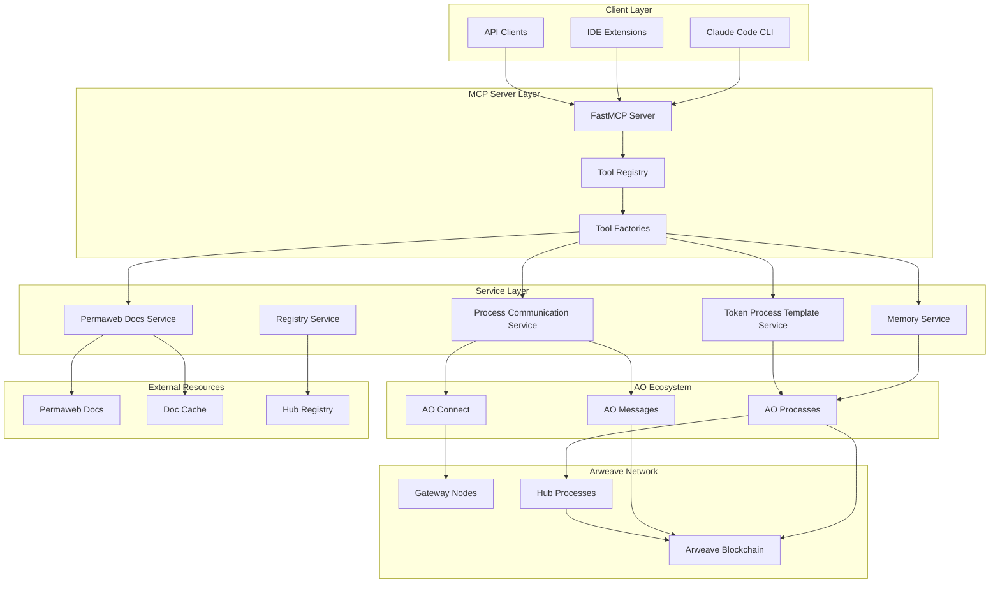
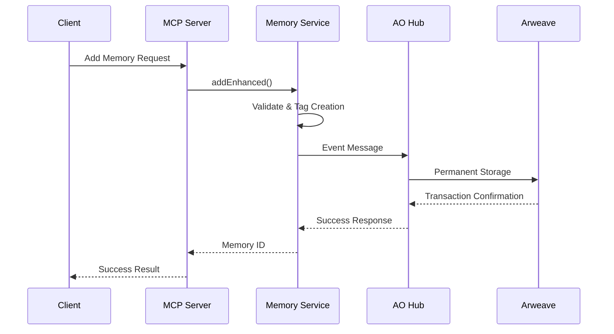
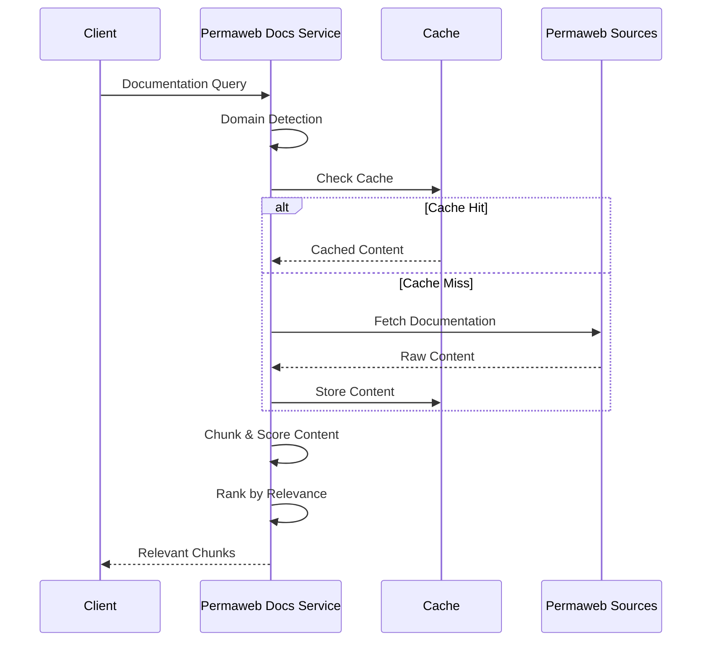
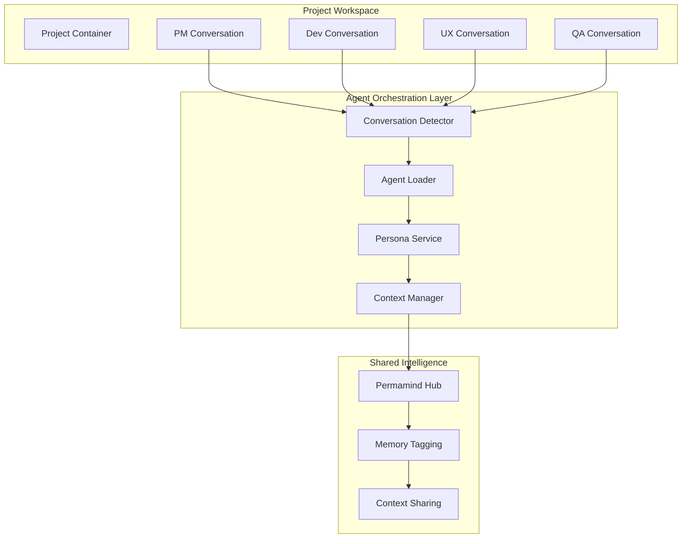
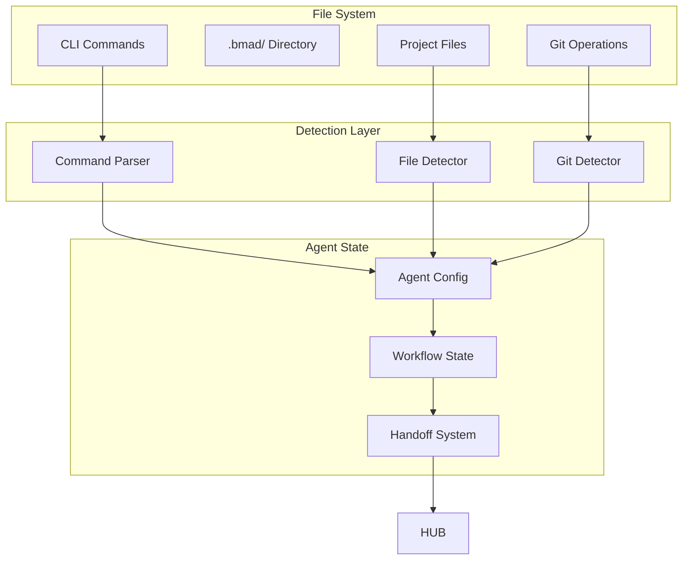

# Permamind Architecture

## Overview

Permamind is a sophisticated MCP (Model Context Protocol) server that provides an immortal memory layer for AI agents and clients. Built on TypeScript with FastMCP, it leverages Arweave's permanent storage and the AO (Autonomous Objects) ecosystem to create persistent, decentralized AI memory with intelligent process communication capabilities.

## System Architecture

### High-Level Architecture



### Technology Stack

#### Core Technologies

- **TypeScript 5.8+** - Primary language with strict typing
- **FastMCP 1.27+** - TypeScript MCP server framework
- **Node.js 20+** - Runtime environment
- **AO Connect 0.0.85** - Interface to AO ecosystem
- **Arweave 1.15+** - Permanent data storage

#### Development & Quality Assurance

- **Vitest 3.1+** - Testing framework with coverage
- **ESLint + Prettier** - Code quality and formatting
- **TypeScript ESLint** - Advanced linting for TypeScript
- **Semantic Release** - Automated versioning and publishing

## Core Components

### 1. MCP Server Implementation (`src/server.ts`)

The main server orchestrates the entire system with a sophisticated initialization strategy:

**Key Responsibilities:**

- Manages Arweave wallet creation/import from mnemonic
- Handles hub registry integration and profile management
- Implements dual-phase tool registration (basic + enhanced)
- Provides graceful startup with background initialization

**Initialization Flow:**

1. Load environment configuration silently for MCP compatibility
2. Generate/load Arweave keypair from `SEED_PHRASE`
3. Register with hub registry or create new profile
4. Initialize embedded process templates
5. Register tools immediately with basic context
6. Complete full initialization in background
7. Update tool context without re-registration

### 2. Service Layer Architecture

#### AI Memory Service (`src/services/aiMemoryService.ts`)

The cornerstone of persistent AI memory with advanced analytics:

**Core Features:**

- **Enhanced Memory Operations**: Structured memory storage with validation
- **Relationship Analysis**: Memory linking with strength scoring
- **Advanced Search**: Multi-dimensional filtering and ranking
- **Analytics Engine**: Usage patterns and importance distribution
- **Batch Operations**: Efficient bulk memory processing

**Memory Types Supported:**

- `conversation` - Chat interactions and context
- `knowledge` - Factual information and learning
- `procedure` - Step-by-step processes
- `reasoning` - Decision trees and logic chains
- `enhancement` - Code improvements and optimizations
- `performance` - Metrics and benchmarking
- `workflow` - Process definitions and execution history
- `context` - Comprehensive ecosystem documentation

#### Process Communication Service (`src/services/ProcessCommunicationService.ts`)

Intelligent AO process interaction with natural language processing:

**Key Capabilities:**

- **Markdown Process Parsing**: Convert documentation to executable handlers
- **Natural Language Service**: AI-powered request interpretation
- **Smart Parameter Extraction**: Context-aware parameter mapping
- **Enhanced Token Operations**: Embedded templates for common patterns
- **Response Interpretation**: Structured data extraction from AO responses

**Communication Flow:**

1. Parse user request using NLS patterns
2. Match to appropriate process handler
3. Extract and validate parameters
4. Build AO message with proper tags
5. Execute via AOMessageService
6. Interpret and structure response

#### Permaweb Documentation Service (`src/services/PermawebDocsService.ts`)

Live documentation integration with intelligent caching:

**Documentation Sources:**

- **Arweave Ecosystem**: 65 documents, 21,106 words
- **AO Computer System**: 90 documents, 36,805 words
- **AR.IO Infrastructure**: 125 documents, 78,208 words
- **HyperBEAM Computing**: Implementation documentation
- **Permaweb Glossary**: 9,710 words of terminology

**Advanced Features:**

- **Domain Detection**: AI-powered relevance scoring
- **Intelligent Chunking**: Semantic boundary splitting
- **Cache Management**: 24-hour TTL with retry logic
- **Relevance Ranking**: Multi-factor scoring algorithm
- **Fallback Strategies**: Graceful degradation patterns

### 3. Tool Architecture

#### Tool Registry System (`src/tools/core/ToolRegistry.ts`)

Centralized tool management with category organization:

**Design Patterns:**

- **Factory Pattern**: Tool factories for each domain
- **Registry Pattern**: Central tool registration and discovery
- **Command Pattern**: Unified tool execution interface
- **Category Organization**: Logical grouping of related tools

#### Tool Categories

**Memory Tools** (`src/tools/memory/`)

- `AddMemoryCommand` - Enhanced memory storage
- `SearchMemoriesCommand` - Advanced search with filters

**Token Tools** (`src/tools/token/`)

- `GetTokenBalanceCommand` - Balance queries with resolution
- `GetTokenInfoCommand` - Comprehensive token metadata
- `TransferTokensCommand` - Token transfers with validation
- `ListTokensCommand` - Registry enumeration
- `SaveTokenMappingCommand` - Token name/ID mapping

**Process Tools** (`src/tools/process/`)

- `CreateProcessCommand` - Spawn new AO processes with template support
- `EvalProcessCommand` - Execute Lua code within processes for testing/setup
- `ExecuteActionCommand` - Smart process communication
- `ExecuteProcessActionCommand` - Markdown-driven execution
- `QueryAOProcessMessagesCommand` - Message history analysis

The Process Tools provide complete AO process lifecycle management:
**Create → Evaluate → Communicate → Query** workflows enable comprehensive
process development, testing, and monitoring capabilities.

**Documentation Tools** (`src/tools/documentation/`)

- `QueryPermawebDocsCommand` - Live documentation queries
- `ManagePermawebDocsCacheCommand` - Cache management
- `DeployPermawebDirectoryCommand` - Permaweb deployment
- `CheckPermawebDeployPrerequisitesCommand` - Deployment validation

**Contact Tools** (`src/tools/contact/`)

- `ListContactsCommand` - Address book management
- `SaveAddressMappingCommand` - Contact name mapping

**User Tools** (`src/tools/user/`)

- `GetUserPublicKeyCommand` - Wallet address retrieval
- `GetUserHubIdCommand` - Hub ID management

### 4. AO Ecosystem Integration

#### Core Integration Patterns

**Process Communication** (`src/process.ts`)

- **AO Connect Integration**: Message sending and process spawning
- **Scheduler Integration**: Reliable message execution
- **Data Item Signing**: Cryptographic message authentication
- **Process Management**: Creation and lifecycle management

**Event Relay System** (`src/relay.ts`)

- **Event Broadcasting**: Hub-based event distribution
- **VIP-01 Compliance**: Standard-compliant filtering
- **Result Processing**: Enhanced data transformation
- **Error Handling**: Graceful failure management

#### Message Factory (`src/messageFactory.ts`)

Standardized message construction for AO operations:

- `FetchEvents` - Event querying with filters
- `Register` - Hub registry operations
- `Info` - Process information retrieval
- `Eval` - Code execution in processes

### 5. Data Models

#### Memory Model Hierarchy

**Base Memory** (`src/models/Memory.ts`)

```typescript
interface Memory {
  id: string;
  content: string;
  timestamp: string;
  p: string; // public key
  role: string;
}
```

**AI Memory Extension** (`src/models/AIMemory.ts`)

```typescript
interface AIMemory extends Memory {
  memoryType: MemoryType;
  importance: number; // 0-1 relevance score
  context: MemoryContext;
  metadata: MemoryMetadata;
  reasoning?: ReasoningTrace;
  relationships?: MemoryLink[];
}
```

**Advanced Analytics**

- Memory relationship graphs
- Importance distribution analysis
- Access pattern tracking
- Circular reference detection

## Data Flow Architecture

### Memory Storage Flow



### Process Communication Flow

```mermaid
sequenceDiagram
    participant Client
    participant PCS as Process Communication
    participant NLS as Natural Language Service
    parameter AO as AO Process
    participant AR as Arweave

    Client->>PCS: Natural Language Request
    PCS->>NLS: Parse Request
    NLS->>PCS: Handler + Parameters
    PCS->>AO: AO Message
    AO->>AR: Process Execution
    AR-->>AO: Execution Result
    AO-->>PCS: Response Message
    PCS->>PCS: Interpret Response
    PCS-->>Client: Structured Result
```

### Documentation Query Flow



## System Boundaries & Integration Points

### External System Interfaces

#### Arweave Network Integration

- **Gateway URLs**: Primary and fallback gateway management
- **Transaction Posting**: Direct blockchain interaction
- **Data Retrieval**: Permanent storage access
- **Wallet Management**: Cryptographic key handling

#### AO Ecosystem Integration

- **Process Spawning**: Autonomous object creation
- **Message Routing**: Inter-process communication
- **Scheduler Integration**: Execution timing management
- **Module Loading**: WebAssembly module deployment

#### Permaweb Documentation

- **Live Documentation Sources**: Real-time doc fetching
- **Cache Management**: Performance optimization
- **Content Processing**: Intelligent chunking and ranking
- **Error Handling**: Graceful fallback strategies

### Security Architecture

#### Cryptographic Security

- **Ed25519 Signatures**: Message authentication
- **BIP39 Mnemonics**: Deterministic key generation
- **JWK Format**: Arweave-compatible key storage
- **Data Item Signing**: AOConnect integration

#### Access Control

- **Hub-Based Permissions**: Decentralized access management
- **Process Ownership**: Creator-controlled processes
- **Message Validation**: Cryptographic verification
- **Rate Limiting**: DoS protection

#### Privacy & Data Protection

- **Local Key Storage**: No remote key transmission
- **Memory Encryption**: Optional content protection
- **Selective Sharing**: Granular permission control
- **Audit Trails**: Comprehensive activity logging

## Performance Characteristics

### Scalability Patterns

#### Horizontal Scaling

- **Stateless Design**: Server instances can be replicated
- **External State**: All persistence in Arweave/AO
- **Load Distribution**: Multiple gateway support
- **Cache Partitioning**: Distributed documentation cache

#### Performance Optimizations

- **Background Initialization**: Non-blocking startup
- **Lazy Loading**: On-demand resource loading
- **Batch Operations**: Efficient bulk processing
- **Connection Pooling**: Gateway connection reuse

### Caching Strategy

#### Multi-Level Caching

1. **In-Memory Cache**: Fast access to recent data
2. **Documentation Cache**: 24-hour TTL for docs
3. **Token Mapping Cache**: Registry information
4. **Process Template Cache**: Embedded templates

#### Cache Invalidation

- **TTL-Based Expiry**: Automatic cache refresh
- **Manual Invalidation**: Explicit cache clearing
- **Version-Based**: Template version tracking
- **Error Recovery**: Fallback mechanisms

## Development & Deployment

### Build System

- **TypeScript Compilation**: ES modules with .js extensions
- **Automated Testing**: Vitest with coverage reporting
- **Code Quality**: ESLint + Prettier integration
- **Dependency Management**: npm with lock files

### Testing Strategy

- **Unit Testing**: Individual component testing
- **Integration Testing**: Cross-service validation
- **Coverage Targets**: 90% functions, 85% lines
- **Mock Strategy**: External dependency isolation

### Deployment Architecture

- **CLI Distribution**: npm package deployment
- **Environment Configuration**: dotenv-based settings
- **Process Management**: PM2/systemd compatibility
- **Monitoring**: Structured logging and metrics

## Future Architecture Considerations

### Planned Enhancements

1. **Agent UX Revolution**: Dual-platform collaborative AI teams
2. **Distributed Caching**: Redis/memcached integration
3. **Event Streaming**: Real-time memory updates
4. **Advanced Analytics**: Machine learning integration
5. **Multi-Network Support**: Cross-chain compatibility
6. **Federated Architecture**: Distributed server networks

### Agent UX Enhancement Architecture

The future Agent UX system will transform Permamind into a collaborative AI team platform:

#### Dual-Platform Integration

**Claude Desktop Architecture:**



**Claude Code Architecture:**



#### Memory-Driven Collaboration

**Context Sharing Architecture:**

- **Single Hub Design**: All agents share one Permamind hub
- **Smart Tagging**: Memory tagged with agent roles and sharing permissions
- **Workflow Awareness**: Context filtered by project stage and agent specialization
- **Cross-Platform Sync**: Seamless context transfer between Claude Desktop and Claude Code

#### Persona Management System

**Dynamic Persona Loading:**

- **Workflow Integration**: Personas adapt to BMad workflow stages
- **Team Coordination**: Complementary personalities for optimal collaboration
- **Evolution Engine**: Personas improve based on user feedback and performance
- **Context Optimization**: Agent-specific memory filtering for focused interactions

### Extensibility Points

1. **Agent Persona System**: Dynamic AI team member personalities
2. **Plugin Architecture**: Custom tool development
3. **Protocol Extensions**: New MCP capabilities
4. **Storage Backends**: Alternative persistence layers
5. **AI Model Integration**: Custom reasoning engines
6. **Workflow Engines**: Advanced process orchestration

## Conclusion

The Permamind architecture provides a robust foundation for persistent AI memory and AO process interaction. By combining the reliability of Arweave with the computational power of AO and the standardization of MCP, it creates a powerful platform for AI-driven blockchain applications.

The system's modular design, comprehensive error handling, and performance optimizations ensure reliable operation while maintaining the flexibility needed for evolving blockchain technologies and AI capabilities.
