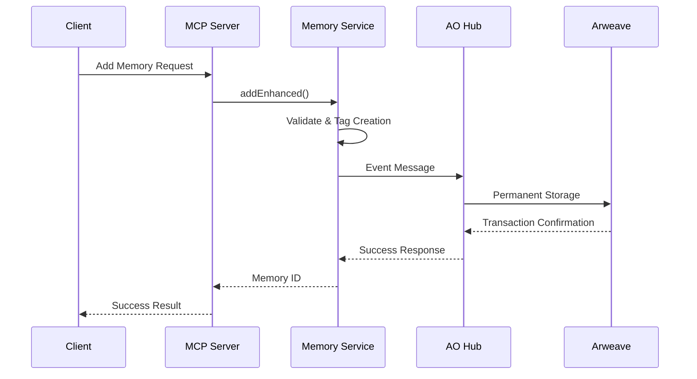
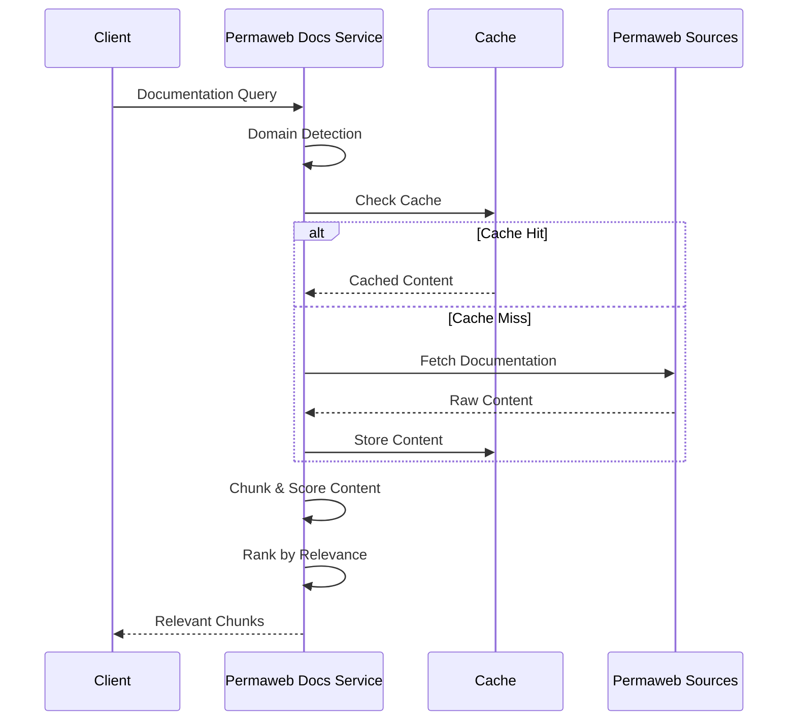

# Data Flow Architecture

## Memory Storage Flow



## Process Communication Flow

```mermaid
sequenceDiagram
    participant Client
    participant PCS as Process Communication
    participant NLS as Natural Language Service
    parameter AO as AO Process
    participant AR as Arweave

    Client->>PCS: Natural Language Request
    PCS->>NLS: Parse Request
    NLS->>PCS: Handler + Parameters
    PCS->>AO: AO Message
    AO->>AR: Process Execution
    AR-->>AO: Execution Result
    AO-->>PCS: Response Message
    PCS->>PCS: Interpret Response
    PCS-->>Client: Structured Result
```

## Documentation Query Flow


