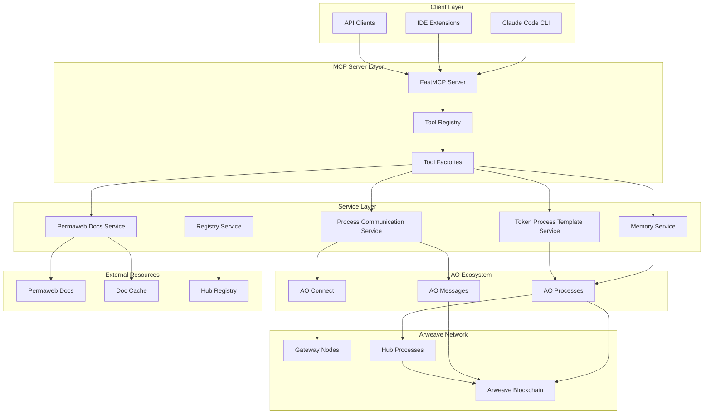

# System Architecture

## High-Level Architecture

## Technology Stack

### Core Technologies

- **TypeScript 5.8+** - Primary language with strict typing
- **FastMCP 1.27+** - TypeScript MCP server framework
- **Node.js 20+** - Runtime environment
- **AO Connect 0.0.85** - Interface to AO ecosystem
- **Arweave 1.15+** - Permanent data storage

### Development & Quality Assurance

- **Vitest 3.1+** - Testing framework with coverage
- **ESLint + Prettier** - Code quality and formatting
- **TypeScript ESLint** - Advanced linting for TypeScript
- **Semantic Release** - Automated versioning and publishing
